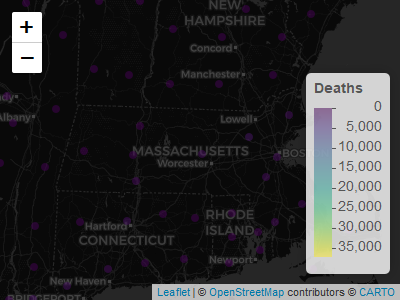

<!-- README.md is generated from README.Rmd. Please edit that file -->

# betterCallSal

<!-- badges: start -->

[](https://travis-ci.com/zahrasalarian/betterCallSal)
<!-- badges: end -->

The goal of betterCallSal is to make you aware of what Covid-19 is doing
to the world

## Installation

You can install the released version of betterCallSal from
[CRAN](https://CRAN.R-project.org) with:

``` r
install.packages("betterCallSal")
```

And the development version from [GitHub](https://github.com/) with:

``` r
# install.packages("devtools")
devtools::install_github("zahrasalarian/betterCallSal")
```

## Website

### You may want to first check the website and see how to get started: <https://zahrasalarian.github.io/betterCallSal/>

## Example

This is a basic example which shows you how to solve a common problem:

``` r
library(betterCallSal)
# Wrong format
period = c("5-6-2020","7-8-2020")
country = "US"
plot <- betterCallSal::drawCovidPlot(period,country)
#> 
#> Attaching package: 'dplyr'
#> The following objects are masked from 'package:stats':
#> 
#>     filter, lag
#> The following objects are masked from 'package:base':
#> 
#>     intersect, setdiff, setequal, union
#> -- Attaching packages -------------------- tidyverse 1.3.0 --
#> v ggplot2 3.3.2     v purrr   0.3.4
#> v tibble  3.0.3     v stringr 1.4.0
#> v tidyr   1.1.2     v forcats 0.5.0
#> v readr   1.4.0
#> Warning: package 'ggplot2' was built under R version 4.0.3
#> Warning: package 'readr' was built under R version 4.0.3
#> -- Conflicts ----------------------- tidyverse_conflicts() --
#> x dplyr::filter() masks stats::filter()
#> x dplyr::lag()    masks stats::lag()
#> Warning: package 'reshape' was built under R version 4.0.3
#> 
#> Attaching package: 'reshape'
#> The following objects are masked from 'package:tidyr':
#> 
#>     expand, smiths
#> The following object is masked from 'package:dplyr':
#> 
#>     rename
#> Warning: `summarise_each_()` is deprecated as of dplyr 0.7.0.
#> Please use `across()` instead.
#> This warning is displayed once every 8 hours.
#> Call `lifecycle::last_warnings()` to see where this warning was generated.

####
# You Got error because your date format is not Correct
# Correct format
period = c("05-06-2020","07-08-2020")
country = "US"
plot <- betterCallSal::drawCovidPlot(period,country)
```

## Lets see an example of world map

``` r
map <- betterCallSal::drawCovidMap("09-09-2020","Deaths")
#> 
#> Attaching package: 'RCurl'
#> The following object is masked from 'package:tidyr':
#> 
#>     complete
map
```



## You can also embed plots, for example:


